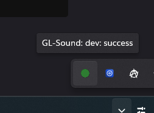
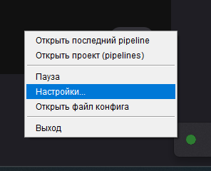
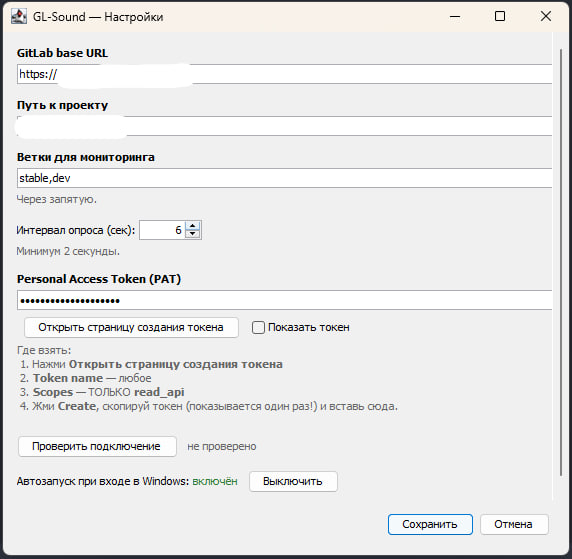

# GL-Sound

Утилита для трея Windows. Смотрит на страницу pipelines в GitLab и играет разные звуки на успех и падение последнего пайплайна.



## Сборка

Нужен только JDK 25. Качаешь ZIP с https://jdk.java.net/25/ и распаковываешь в `%USERPROFILE%\.jdks\openjdk-25.x.x` так, чтобы внутри лежал `bin\javac.exe` — туда смотрит билд-скрипт.

Maven ставить не надо. `build.cmd` сам скачает нужную версию в `%USERPROFILE%\.gl-sound\tools\` при первом запуске (≈10 МБ, один раз).

Из корня проекта:

```
packaging\build.cmd
```

На выходе — `target\dist\GL-Sound\GL-Sound.exe`.

## Запуск

Запускаешь `GL-Sound.exe`, в трее появляется иконка. На первом запуске она оранжевая — токена ещё нет. Правый клик по иконке открывает меню:



В **Настройках...** заполняешь поля:



- URL GitLab — без хвоста `/-/pipelines` и без слеша в конце
- Путь к проекту — то, что идёт в адресной строке после домена (`group/subgroup/project`)
- Ветки — через запятую
- PAT — рядом кнопка, открывает страницу создания токена; scope нужен только `read_api`

«Проверить подключение» делает один реальный запрос и пишет результат прямо в диалог. «Сохранить» применяется на лету, перезапускать ничего не надо.

Внизу диалога — тогл автозапуска. Пишет себя в `HKCU\Software\Microsoft\Windows\CurrentVersion\Run`, прав администратора не требует, в корпоративном домене не упирается в групповые политики.

Конфиг лежит в `%APPDATA%\GL-Sound\config.properties`, лог — рядом, в `gl-sound.log.0`.
